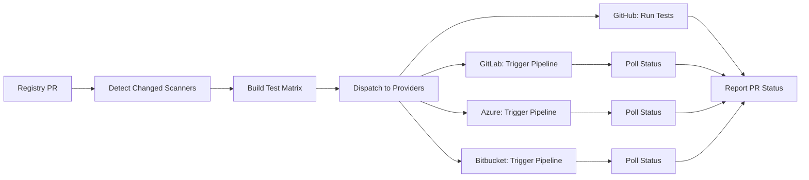

# Scanner Registry Testing System

## Overview

This document describes the automated testing system for validating scanner and converter updates across GitHub, GitLab, Azure DevOps, and Bitbucket CI/CD platforms.

## Core Principles

1. **Registry-Driven Testing**: Tests are triggered when the scanner registry is updated, not when converters are updated
2. **Single Runner Per Provider**: Each CI/CD provider has ONE runner repository that executes tests
3. **Parallel Execution**: Tests run in parallel within each provider for speed
4. **Security-First**: No execution of untrusted code; only clone from allowlisted public repositories

## Architecture

```
scanner-registry/
├── scanners/
│   └── boostsecurityio/
│       └── trivy/
│           ├── module.yaml          # Scanner & converter versions
│           └── tests.yaml           # Test definitions
│
├── .github/
│   └── workflows/
│       └── test-scanner-update.yml  # Orchestrates testing
│
Runner Repositories (one per provider):
├── gitlab.com/boost-security/pipeline-runner
├── dev.azure.com/boost-security/runners/pipeline-runner
├── bitbucket.org/boost-security/pipeline-runner
```

## Test Definition Format

Tests are defined in `tests.yaml` alongside each scanner's `module.yaml`:

```yaml
# scanners/boostsecurityio/trivy/tests.yaml
version: 1.0
tests:
  - name: "Smoke test"
    type: "source-code"
    source:
      url: "https://github.com/org/repo.git"
      ref: "tag123"
    scan_paths:
      - "/folder1"
      - "/folder2"
        
  - name: "Smoke test with configs"
    type: "source-code"
    source:
      url: "https://github.com/org/repo.git"
      ref: "tag123"
    scan_configs:
      - default: true
      - rules: ["rule1", "rule2"]
    timeout: 300s

  - name: "Smoke test with image"
    type: "docker-image"
    source:
      url: "https://github.com/org/repo.git"
      ref: "tag123"
    scan_paths:
      - "/folder1"
      - "/folder2"
```

## Test Types

### 1. source-code
- Clone from allowlisted organizations (OWASP, vulnerable-by-design repos)
- Test against real-world code
- Can specify branch/tag and multiple scan paths
- Will run the scanner agains the code

### 2. docker-image
- Clone from allowlisted organizations (OWASP, vulnerable-by-design repos)
- Test against real-world code
- Can specify branch/tag and multiple scan paths
- Will build the image located in the scan path and run test agains it

### 3. Test with configs
- Test can be repeated for several configurations

## Development Workflow

1. **Scanner Update Available** (e.g., Trivy 0.46)
2. **Update Converter** to support new scanner output format
3. **Create Registry PR** updating both:
    - `module.yaml`: New scanner and converter versions
    - `tests.yaml`: Update tests if needed
4. **Automated Testing** triggers on PR:
    - GitHub Actions orchestrates all providers
    - Each provider runs tests in parallel
    - Results reported as PR status checks
5. **Merge on Success** when all 4 providers pass

## Parallelization Strategy

### GitHub Actions (Native)
```yaml
strategy:
  matrix: ${{ fromJson(needs.prepare.outputs.test_matrix) }}
```

### GitLab (Dynamic Child Pipelines)
- Generate pipeline configuration at runtime
- Create parallel jobs based on test matrix

### Azure DevOps (Template Parameters)
- Pass test matrix as pipeline parameters
- Expand to parallel jobs using templates

### Bitbucket (Pre-allocated Slots)
- Use N pre-defined parallel steps
- Distribute tests across slots evenly

## Security Controls

1. **Allowlisted Sources Only** ⚠️ VALIDATE
   ```yaml
   allowed_repos:
     - https://github.com/OWASP/*
     - https://github.com/vulnerable/*
     - https://github.com/intentionally-vulnerable-*
   ```

2. **No Arbitrary Code Execution**
    - Never execute scripts from test targets
    - Only run scanner binaries with defined parameters

3. **Timeout Enforcement**
    - Default: 5 minutes per test
    - Maximum: 10 minutes per test
    - Pipeline timeout: 30 minutes

4. **Image Verification**  ⚠️ VALIDATE
    - Only pull converter images from `public.ecr.aws/boostsecurityio/*`
    - Verify image digest if provided

## Status Checks

Each PR will have 4 status checks:
- ✅ `Scanner Tests / GitHub`
- ✅ `Scanner Tests / GitLab`
- ✅ `Scanner Tests / Azure DevOps`
- ✅ `Scanner Tests / Bitbucket`

All must pass before merge is allowed.

## Implementation Steps

### Phase 1: Setup Runner Repositories
1. Create runner repository in each provider
2. Add pipeline configuration for test execution
3. Configure authentication tokens

### Phase 2: Registry Workflow
1. Add `.github/workflows/test-scanner-update.yml`
2. Implement test matrix builder
3. Add dispatch logic for each provider

### Phase 3: Test Framework
1. Create test execution script (`scripts/run-scanner-test.sh`)
2. Implement test types (source-code, docker-image)
3. Add result validation logic

### Phase 4: Authentication
| Provider | Token Type | Permissions | Secret Name |
|----------|------------|-------------|-------------|
| GitLab | Personal Access Token | `api, write_repository` | `GITLAB_TOKEN` |
| Azure | Personal Access Token | `Code (R&W), Build (R&E)` | `AZURE_PAT` |
| Bitbucket | App Password | `repository:write, pipeline:write` | `BITBUCKET_APP_PASSWORD` |

## Test Execution Flow



## Limitations

1. **Bitbucket**: Maximum 5-10 parallel tests (static configuration)
2. **Polling**: 30-second intervals may add latency
3. **Token Management**: Requires periodic rotation
4. **Test Data**: Limited to public repositories and synthetic tests

## Future Enhancements

- [ ] Add test result caching
- [ ] Implement test metrics dashboard
- [ ] Add support for private test repositories (with additional security)
- [ ] Create test result artifacts for debugging
- [ ] Add performance benchmarking

## FAQ

**Q: Why test only on registry updates, not converter updates?**  
A: The normal flow is to update converter and registry together when a new scanner version is released. Testing them separately would create false positives.

**Q: Why not use repository mirroring?**  
A: Managing 3N mirror repositories (N converters × 3 providers) is complex and error-prone. Single runners are simpler.

**Q: How do we prevent malicious code execution?**  
A: Tests only clone from allowlisted public repositories and never execute arbitrary code from test targets.

**Q: What if a test fails on one provider but passes on others?**  
A: This indicates a platform-specific issue that needs investigation. The test must pass on all providers.
